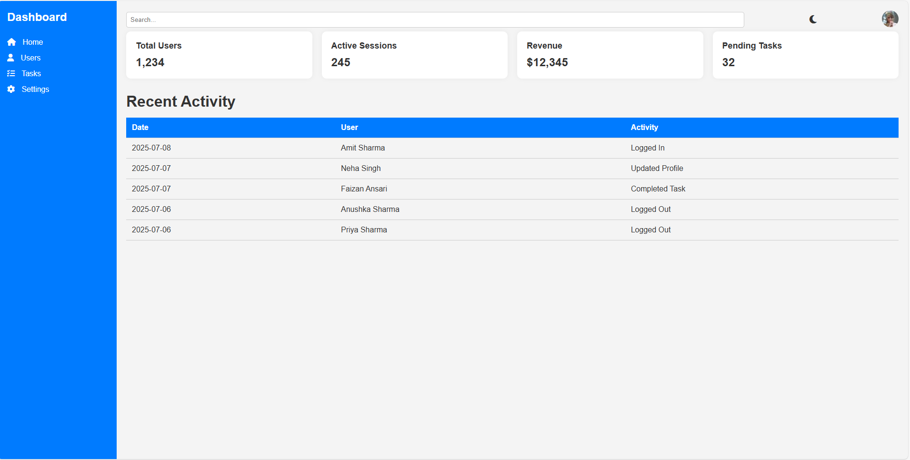

# Responsive Admin Dashboard

This is a mini project built as part of a pre-joining internship task at TrueInception Pvt. Ltd. The project demonstrates frontend skills using HTML, CSS, and JavaScript.

## Features

- Sidebar Navigation with Icons
- Header Bar with Search & User Profile
- Dashboard Cards (Total Users, Active Sessions, Revenue, Pending Tasks)
- Recent Activity Table with Dummy Data
- Dark/Light Theme Toggle
- Fully Responsive Design

## Project Structure

## How to Run

1. Clone this repository:

2. Navigate to the project folder:

3. Open `index.html` in your browser.

## Deployment (Optional)

You can deploy the site using:
- GitHub Pages
- Netlify
- Vercel

## Technologies Used

- HTML
- CSS (Flexbox & Grid)
- JavaScript (Vanilla)
- Font Awesome (Icons)

## Screenshots

### Desktop View  

### Mobile View  

## (Optional) Live Demo
[Click here to view the Admin Dashboard](https://zoya-admin-dashboard.netlify.app)

## Author

**Zoya Ansari**  
Frontend Developer Intern  
[LinkedIn Profile](https://www.linkedin.com/in/your-profile)
